# Mini Amazon

Mini proyecto de e-commerce desarrollado utilizando Python y Flask.

## Características

* Sistema de productos
* Organización modular mediante Blueprints
* Manejo de base de datos SQLite
* Interfaz web tipo tienda online
* Sistema de administración básico

## Tecnologías utilizadas

* Python
* Flask
* HTML
* CSS
* SQLite

## Vista previa

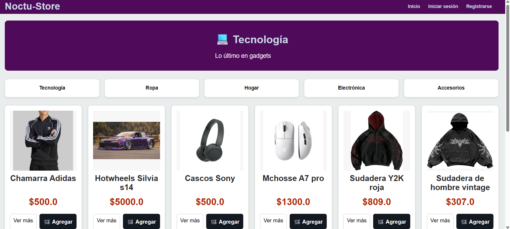

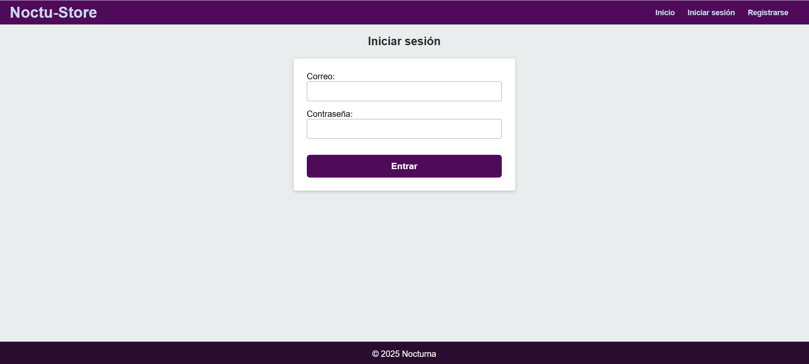

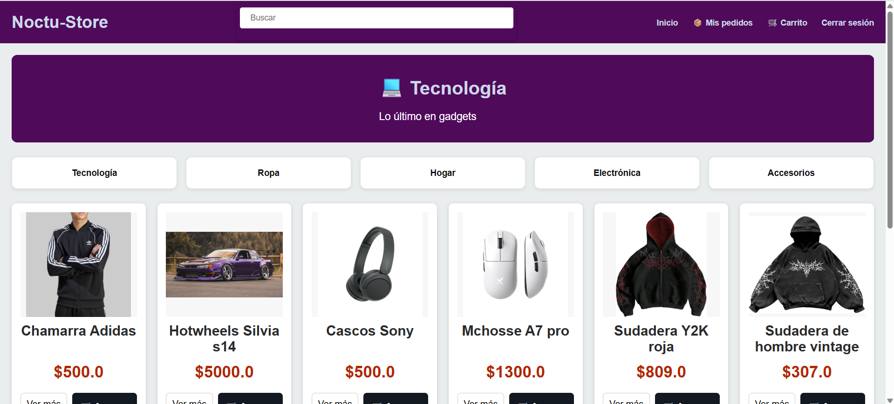

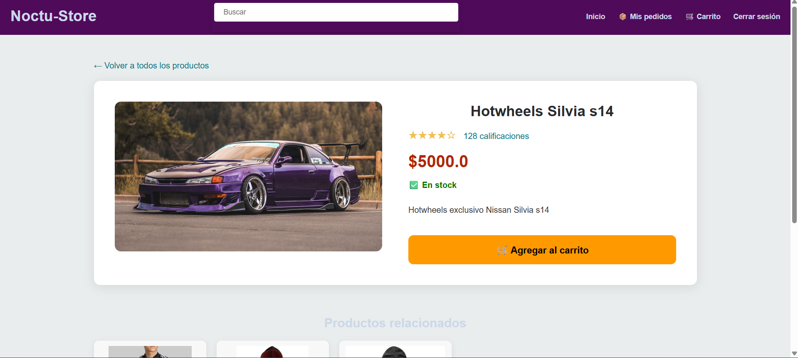

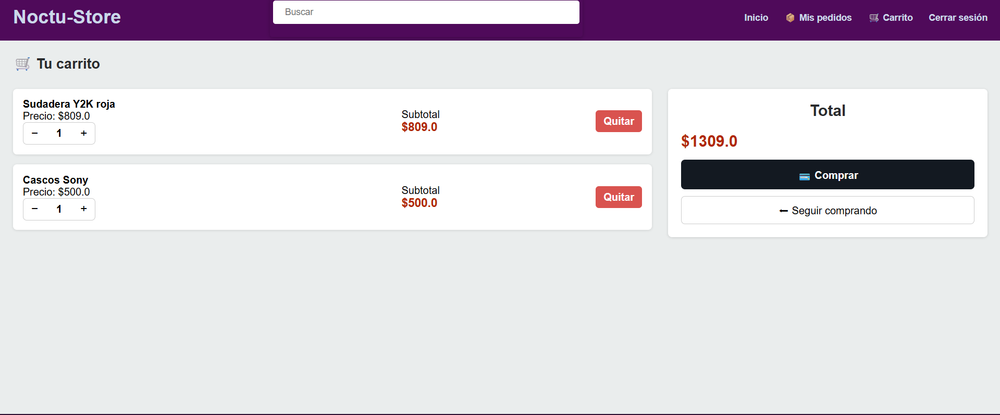

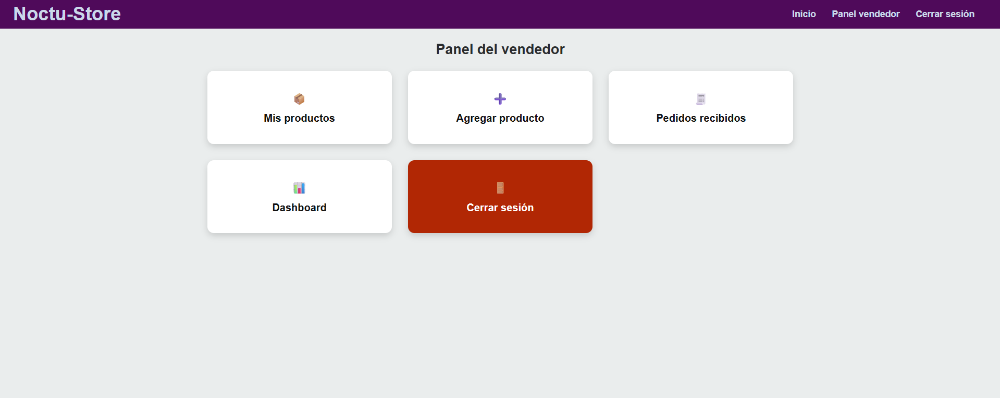

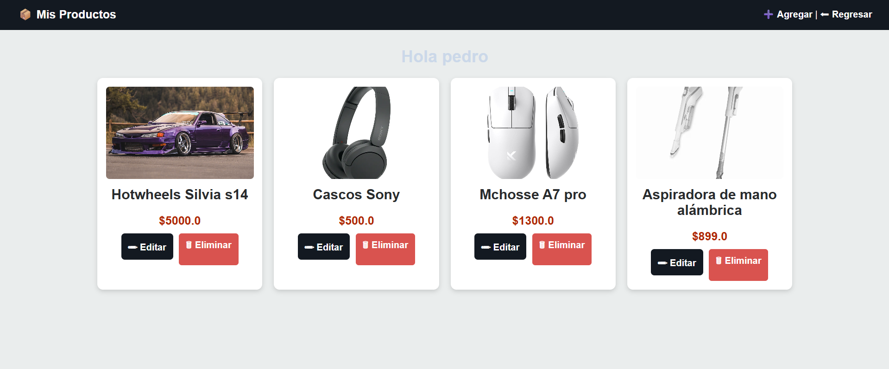

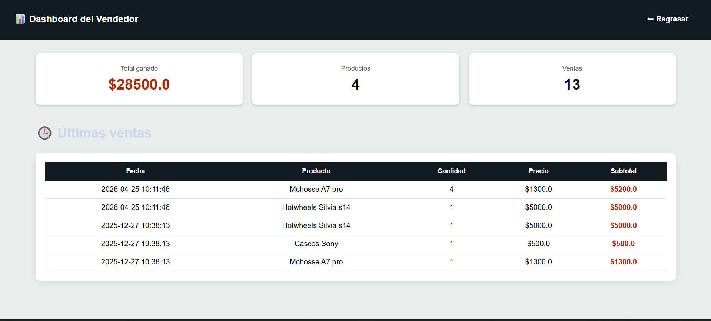

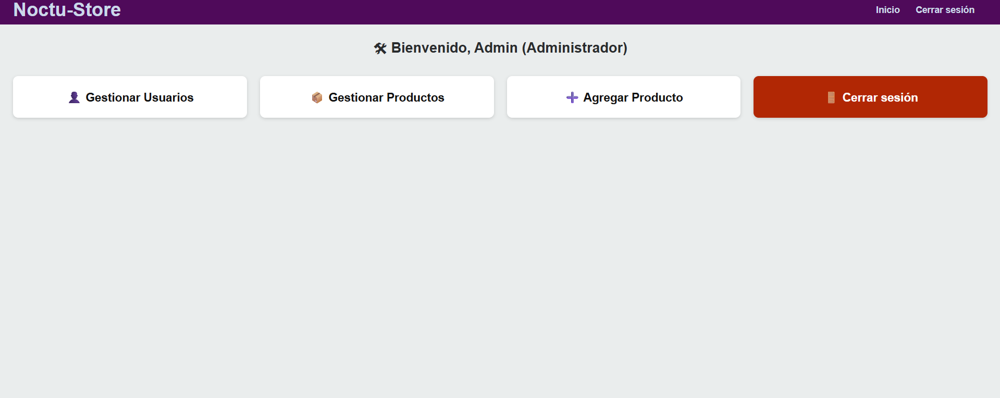

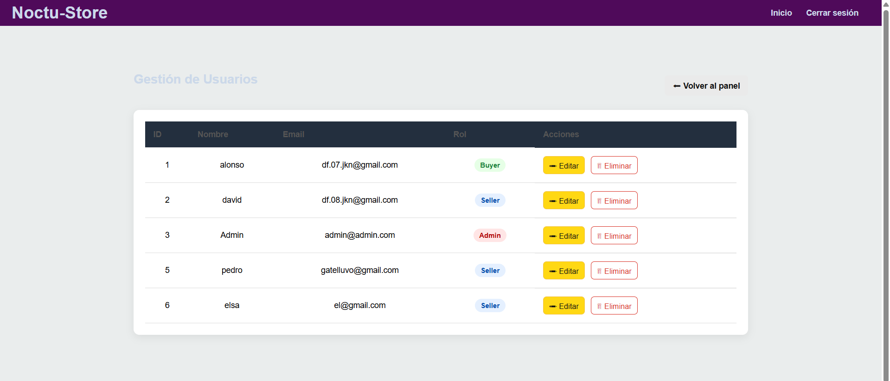

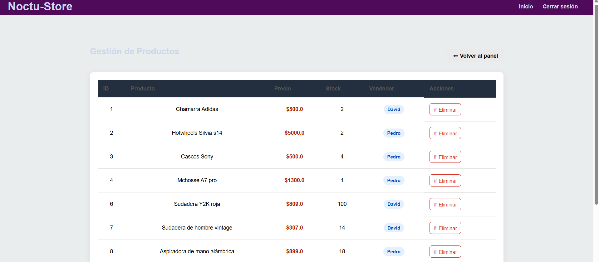

## Objetivo

Practicar desarrollo backend, organización de proyectos web y manejo de bases de datos utilizando Flask.

## Estado del proyecto

En desarrollo.

## Autor

Alonso Flores
